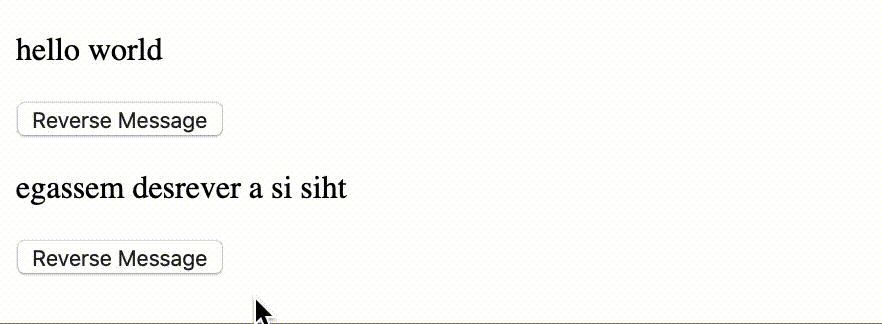

# @mimooo/reverse-str v0.5.0
An npm module for reversing strings in a Vue environment.


[](https://github.com/maryamtb/vue-reverse-str-button/issues)



## Example
```
<template>
  <div id="app">
    <tinylib  :message="'egassem desrever a si siht'" />
  </div>
</template>

<script>
import reverseString from '@mimooo/vue-reverse-str-button'
export default {
  name: 'App',
  components: {
    reverseString
  },
  computed: {
    status: {
      get() { return this.message },
      set(value) {
        this.message = value;
      }
    }
  },
}
</script>
```

## Project setup
```
npm install
```

### Compiles and hot-reloads for development
```
npm run serve
```

### Compiles and minifies for production
```
npm run build
```

### Lints and fixes files
```
npm run lint
```

### Customize configuration
See [Configuration Reference](https://cli.vuejs.org/config/).
